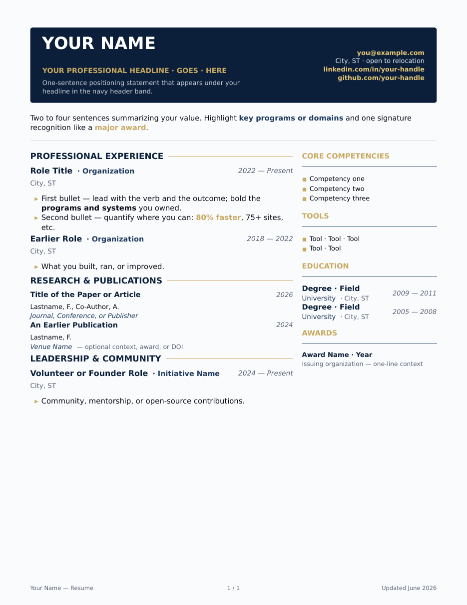
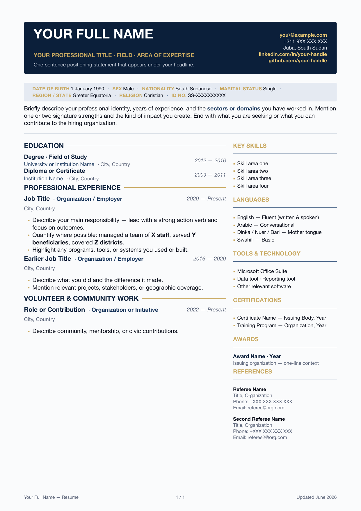

# quarto-tongakuot-cv — Quarto CV Format + Alier Reng's Resume

A reusable **Quarto custom format** (`cv-typst`) that packages the
PyStatR+ resume aesthetic — deep navy, structural blue, and gold accents —
as an installable Typst-based extension, plus Alier Reng's resume built on it.

Originally converted from a `pagedown` RMarkdown resume to Quarto + Typst;
refactored into the `quarto-tongakuot-cv` extension package (June 2026).

## Templates

### US / International (`template.qmd`)

Standard two-column layout — name, headline, tagline, email, location,
LinkedIn, GitHub, website. US Letter paper.



### South Sudan / East Africa (`template-south-sudan.qmd`)

Same layout extended with a **personal details band** that renders the fields
standard on CVs in South Sudan, Kenya, Uganda, Ethiopia, and most of East Africa:
Date of Birth · Sex · Nationality · Marital Status · Region/State · Religion · ID No.
Also adds: phone in the contact block, Education section first (recommended for
government and NGO applications), Languages as a prominent sidebar section,
and a References section. A4 paper.



> ⭐ **Star this repo on GitHub if you love it and find it useful** — it
> helps others discover the template. Forks and adaptations are welcome.

## Files

| File | Purpose |
|---|---|
| `_extensions/cv/` | The extension: `_extension.yml`, `typst-template.typ` (palette, helpers, layout), `typst-show.typ` (YAML → template mapping). |
| `template.qmd` | Generic starter CV — US / international format. US Letter paper. |
| `template-south-sudan.qmd` | Starter CV for South Sudan and East Africa — A4 paper, personal details band, Education first, Languages, References. |
| `areng_resume.qmd` | Alier's resume — content only; all styling comes from the extension. |
| `areng_resume.typ` | Quarto-generated Typst intermediate (`keep-typ: true`); not hand-edited. |
| `_quarto.yml` | Quarto project config. |

## Using the format

```bash
# Render Alier's resume
quarto render areng_resume.qmd

# Start a new CV from the template (in a fresh directory)
quarto use template tongakuot/quarto-tongakuot-cv

# Or add the format to an existing project
quarto add tongakuot/quarto-tongakuot-cv
```

Requires Quarto 1.5+ (bundled Typst engine). To publish, push this
directory to GitHub as `tongakuot/quarto-tongakuot-cv` — `quarto use
template` and `quarto add` work directly against the repo.

## Adopting this template

The only prerequisite is **Quarto 1.5+** — Typst ships inside Quarto, so
there is no LaTeX and nothing else to install.

**New CV from scratch:**

1. Run `quarto use template tongakuot/quarto-tongakuot-cv` and name the
   directory when prompted. Quarto scaffolds it with a starter `.qmd`
   (renamed to match the directory) and the `_extensions/cv/` format.
2. Replace the placeholder YAML — `name`, `headline`, `tagline`, `email`,
   `location`, `linkedin`, `github` (see *YAML options* below).
3. Fill in the body using the helpers — `entry()` for roles, `edu()` for
   degrees, `award()` for honors, `pub-entry()` for publications (see
   *Helpers available in the body*).
4. Flip the toggles for sections that don't apply, e.g.
   `#let include-publications = false` (see *Section toggles*).
5. `quarto render your-cv.qmd` — the PDF lands in `_output/`.

**Existing project:** run `quarto add tongakuot/quarto-tongakuot-cv`, then
set `format: cv-typst` in the document YAML.

**Pinning a version:** install against a tagged release for reproducible
setups — `quarto add tongakuot/quarto-tongakuot-cv@v1.0.0`. (Maintainer:
`git tag v1.0.0 && git push --tags`.)

The design lives entirely in `_extensions/cv/`; documents carry content
only. Update the format later with `quarto update tongakuot/quarto-tongakuot-cv`.

## Section toggles

The body of each document begins with toggles you can flip:

```typst
#let include-publications = true   // false ⇒ Research & Publications is omitted
```

The **Research & Publications** section ships as a placeholder built on the
`pub-entry(title, authors, venue, year, note: ...)` helper — turn it off in
one keystroke if it doesn't apply.

## YAML options

| Key | Effect |
|---|---|
| `name` | Name in the header band (rendered uppercase) and page footer. |
| `headline` | Gold all-caps line under the name. |
| `tagline` | Light one-liner under the headline. |
| `email` | Right-hand contact block — rendered as a mailto link. |
| `phone` | Phone number in the contact block (plain text). |
| `location`, `linkedin`, `github`, `website` | Additional contact block items; links auto-generated. All optional. |
| `summary` | Optional plain-markdown summary. For styled emphasis, use `#summary-block[...]` in the body instead. |
| `resume-updated` | "Updated …" stamp in the page footer. |
| `papersize` | Typst paper size — `us-letter` (default) or `a4` (recommended for South Sudan / East Africa). |
| **South Sudan / East Africa fields** | |
| `dob` | Date of Birth — shown in the personal details band. |
| `sex` | Sex / Gender — shown in the personal details band. |
| `nationality` | Nationality — shown in the personal details band. |
| `marital-status` | Marital status — shown in the personal details band. |
| `region` | Region or state of origin — shown in the personal details band. |
| `religion` | Religion — shown in the personal details band (optional; include if relevant to the role). |
| `id-number` | National ID or passport number — shown in the personal details band. |

## Helpers available in the body

`section-title(name)`, `sidebar-title(name)`,
`entry(role, org, place, dates, bullets)`, `edu(degree, school, place, dates)`,
`award(title, detail)`, `pub-entry(title, authors, venue, year, note: ...)`,
`summary-block(content)`, `two-col(main, sidebar)`,
plus the palette: `pystatr-navy`, `pystatr-blue`, `pystatr-steel`,
`pystatr-gold`, `pystatr-ink`, `pystatr-mute`, `pystatr-rule`, `pystatr-bg`.

## Color palette (PyStatR+)

```
navy   #0B1F3A    structural background (header band)
blue   #1E3A5F    structural accents and emphasis
steel  #3E5C82    sidebar dividers
gold   #C9A961    accent rules, bullets, highlights
ink    #0A0E1A    body text
mute   #5A6378    secondary text, locations, dates
rule   #D5DBE3    hairline rules
bg     #FAFBFC    page background
```

## Updating the resume

1. Edit `areng_resume.qmd` (content) or the extension files (design).
2. `quarto render areng_resume.qmd`
3. Collect the rendered PDF from `_output/` and submit.

## Dependencies & Acknowledgments

This package intentionally has **zero third-party Quarto extensions** —
everything is built on tools that ship with Quarto:

- **[Quarto](https://quarto.org)** (1.5+) — rendering engine and extension system.
- **[Typst](https://typst.app)** — typesetting engine, bundled with Quarto; no LaTeX required.
- **[pagedown](https://github.com/rstudio/pagedown)** — the RMarkdown package
  behind the original version of this resume; this project's layout lineage
  starts there.
- Rebuilt as a Quarto extension with **Claude** in Anthropic's **Cowork**.

⭐ If this template serves you well, star the repo — and share what you build.
